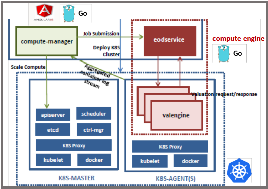

# hwx-pe-k8s-grid

Architectural variation of [hwx-pricing-engine](https://github.com/amolthacker/hwx-pricing-engine) using a grid of compute workers running on [K8s](https://kubernetes.io/).

It comprises of the following two components:
* compute-engine
* compute-manager


## Architecture



## compute-engine

A simple client-server application written in Go. `eodservice` simulates the client that submits valuation requests to a grid of remote compute engine (server) instances - `valengine`. The `valengine` responds to requests by doing static pricing compute using [QuantLib](https://www.quantlib.org/) library through a [Java wrapper library](https://github.com/amolthacker/hwx-pricing-engine/tree/master/compute/src/main/java/com/hwx/pe/valengine/spark) - `computelib`.
The application uses the [Kite](https://github.com/koding/kite) micro-services framework for RPC.

`eodservice` breaks job submissions into batches with a max size of 100 (pricing requests) and the `computelib` prices them in parallel.

The `compute-engine's` [docker image](https://hub.docker.com/r/amolthacker/ve/) builds on top of a [pre-baked image](https://hub.docker.com/r/amolthacker/mockcompute-base/) of the `computelib`.

```
FROM amolthacker/mockcompute-base
LABEL maintainer="amolthacker@gmail.com"

# Paths
ENV COMPUTE_BASE /hwx-pe/compute/

# Copy lib and scripts
RUN mkdir -p $COMPUTE_BASE
ADD . $COMPUTE_BASE
RUN chmod +x $COMPUTE_BASE/compute.sh
RUN cp $COMPUTE_BASE/compute.sh /usr/local/bin/.
RUN cp $COMPUTE_BASE/mockvalengine-0.1.0.jar /usr/local/lib/.

# Start Engine
ENTRYPOINT go run $COMPUTE_BASE/valengine.go

# Ports : 6000 (RPC) | 8000 (HTTP-Health)
EXPOSE 6000 8000
```

## compute-manager

A web based management user interface for the 
`compute-engine` that facilitates following operational tasks:
* Submission of valuation jobs to the compute engine
* Scaling of compute
* Aggregated compute engine log stream

The backend is written in Go and frontend with AngularJS

The demo below captures the demonstration wherein we will:
•	First go through deployment specifics
•	Submit a bunch of compute jobs
•	Watch the pods auto-scale out
•	See the subsequent job submissions balanced across the scaled-out compute engine grid
•	See the compute engine grid scale back in after a period of reduced activity


## Dependencies

The application uses following Go libraries:
* [Kite](https://github.com/koding/kite) micro-service framework
* [Go client](https://github.com/kubernetes/client-go) for K8s
* [Configuration definition](https://github.com/spf13/viper) support


## Operations

### Setup

#### Minikube

* Start `minikube`
```
$ minikube start
```

#### ACS

* Provisiong infrastructure
    ```
    $ cd acs
    $ az group deployment create -n hwx-pe-k8s-grid-create -g k8s-pe-grid --template-file az-deploy.json --parameters @az-deploy.parameters.json
    ```

* Point kubectl to this K8s cluster
    ```
    $ az acs kubernetes get-credentials --ssh-key-file ~/.ssh/az --resource-group=k8s-pe-grid --name=containerservice-k8s-pe-grid
    ```

* Start the proxy
    ```
    $ nohup kubectl proxy 2>&1 < /dev/null &
    ```

#### K8s App

* Deploy the K8s cluster
    ```
    $ kubectl apply -f k8s/
    ```

* Deploy `compute-manager`
    ```
    Clone the repo and add utils under src/compute-manager/scripts/linux to PATH
    ```

* Update the `config/env.toml` file to use the setup environment properties for `compute-engine` and Kubernetes

* Run the web server
 ```
 $ cd ${path-to-compute-manager} 
 $ go run ComputeManager.go
 ```

* Start the SSH tunnel
    ```
    Update SSH config as under scripts/ssh-config
    $ ./scripts/hwxadmin-tunnel.sh start
    ```

* Access the `compute-manager` Web UI
    ```
    http://localhost:8090/login
    ```

### Teardown

#### K8s App

* Stop the SSH tunnel
    ```
    $ ./scripts/hwxadmin-tunnel.sh stop
    ```

* Destroy the K8s cluster
    ```
    $ kubectl delete -f k8s/
    ```

#### Minikube

* Stop `minikube`
    ```
    $ minikube stop
    ```

#### ACS

* Teardown the AZ infrastructure
    ```
    $ cd acs
    $ az group deployment create -n hwx-pe-k8s-grid-create -g k8s-pe-grid --template-file az-teardown.json
    ```

